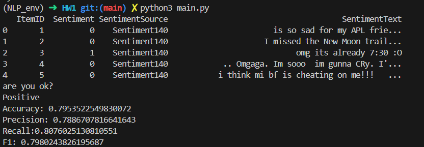

# Report
## Member
- 資工三 110590018 劉承翰 - 程式撰寫、文件撰寫
- 資工三 110590011 劉承軒 - 文件撰寫
## Env
    Python 3.10.12
## Package
    1. sklearn
    2. re
    3. pandas
## data
From Sentiment Analysis Dataset.csv (第一次功課的資料集)
```python=
X_train, X_test, y_train, y_test = train_test_split(X_train, y_train, test_size=0.2, random_state=42)
```
## Result


## Issue
再讀入csv時報了一個錯誤，是有關columns數不對的問題，原本只有4欄的值，但資料及突然多出一個5欄的資料-.-。加入on_bad_lines='skip'後略過有問題的data，成功解決。
```python=
dataset = pd.read_csv("Sentiment Analysis Dataset.csv", on_bad_lines='skip')
```


