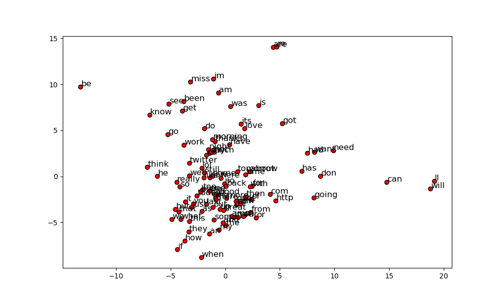

# Report

## Member

- 資工三 110590018 劉承翰 - 程式撰寫

- 資工三 110590011 劉承軒 - 文件撰寫

## Env

```
Python 3.10.1
```


## Package

```
1. pandas
2. matplotlib
3. scikit-learn
```

## Installation flow

Follow the instructions in the Readme.md

## data

From Sentiment Analysis Dataset.csv (第一次功課的dataset)

## Result


## Word2Vec(2-D)

